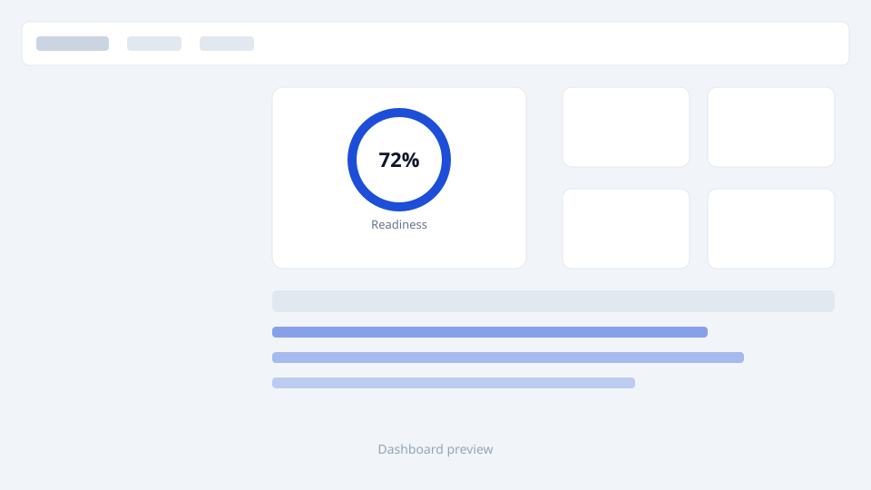
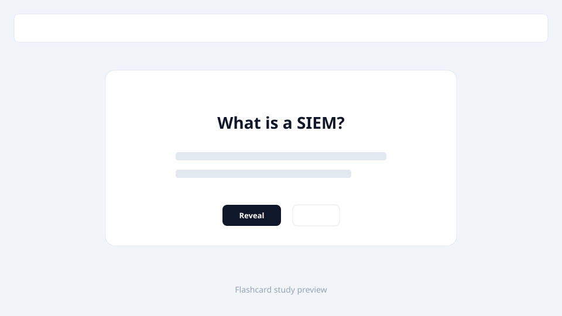
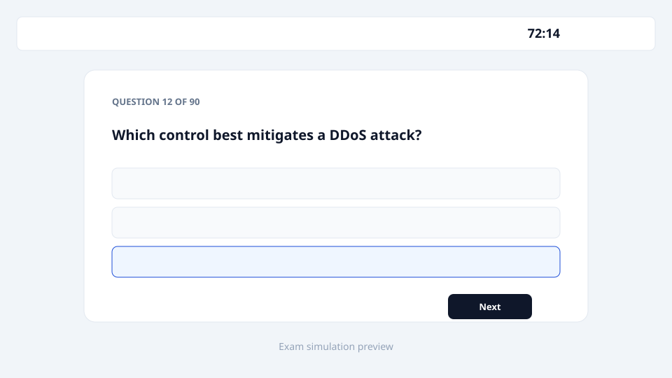

<p align="center">
  
</p>

<h1 align="center">SecPlus Sensei</h1>

<p align="center">
  <strong>Offline-first CompTIA Security+ (SY0-701) desktop study app</strong><br>
  Flashcards · Spaced repetition · Exam simulation · Optional AI tutor
</p>

<p align="center">
  
  
  
  
</p>

<p align="center">
  <a href="docs/GO_LIVE.md"><strong>Go-live checklist</strong></a> ·
  <a href="docs/PORTFOLIO.md"><strong>Portfolio case study</strong></a> ·
  <a href="docs/FREELANCE_COPY.md"><strong>Freelance copy templates</strong></a> ·
  <a href="docs/SCREENSHOTS.md"><strong>Screenshot guide</strong></a>
</p>

> **Unofficial study aid** — not affiliated with or endorsed by CompTIA. "CompTIA" and "Security+" are trademarks of CompTIA, Inc.

---

## At a glance

| | |
|---|---|
| **Built in** | ~3 days (solo) |
| **Flashcards** | 452 across all 5 SY0-701 domains |
| **Questions** | 507 (MCQ, multi-select, PBQs) |
| **Stack** | Electron · Vanilla JS · Three.js · Claude API (optional) |
| **Privacy** | Local-first · No accounts · No telemetry |

---

## Features

- **SM-2 spaced repetition** — ease factors, intervals, leeches, mastered tracking, keyboard shortcuts
- **Adaptive quizzes** — weak-domain weighting, instant feedback, missed-question flashcard suggestions
- **90-minute exam simulator** — PBQs first, scaled scoring (100–900), per-domain breakdown, attempt history
- **Readiness dashboard** — domain-weighted %, XP/levels, daily quests, achievements, streaks, study plans
- **Acronym rapid-fire** — drill all term cards until you know them cold
- **Optional AI tutor** (BYOK Anthropic Claude) — optimize cards, embedded card chat, quiz explanations
- **Custom cards** — add your own, export/import full state as JSON
- **Desktop packaging** — Windows NSIS installer, auto-update, progress survives reinstalls

---

## Screenshots

_Add 3–4 captures to `docs/screenshots/` — see [docs/SCREENSHOTS.md](docs/SCREENSHOTS.md). Takes ~15 min._

<!--
<p align="center">
  
</p>
<p align="center">
  
  
</p>
-->

---

## For recruiters & clients

This repo demonstrates **end-to-end product delivery**: real exam content, desktop installer, update pipeline, onboarding, gamification, and responsible optional AI — not a tutorial todo app.

**Full case study → [docs/PORTFOLIO.md](docs/PORTFOLIO.md)**

**Ready-to-paste profile copy → [docs/FREELANCE_COPY.md](docs/FREELANCE_COPY.md)**

---

## Quick start (development)

```bash
git clone https://github.com/jacobbarrera2024-sketch/secplus-sensei.git
cd secplus-sensei
npm install
npm start
```

## Build Windows installer

```bash
npm run build
```

Or on Windows: double-click **`Build SecPlus Sensei.bat`** (installs deps, syncs version, builds NSIS installer to `dist/`).

End-user install/update instructions: **[README.txt](README.txt)**

---

## Optional AI setup

AI is **off by default**. The app works fully offline without it.

1. Get a free API key at [console.anthropic.com](https://console.anthropic.com)
2. Open the app → **Dashboard** → paste key → Save
3. Use Optimize, Card tutor, and quiz explanations as needed

Your key stays on your device. The only network calls are your direct requests to Anthropic.

> **Privacy:** keys are stored in plain text locally. Exported backups also contain your key — keep them private.

---

## Project structure

```
secplus-sensei/
├── secplus-sensei.html   # Entire app (HTML + CSS + JS + seed content)
├── main.js               # Electron main process
├── preload.js            # Secure IPC bridge
├── assets/               # App icons
├── build/                # NSIS installer scripts
├── docs/                 # Portfolio case study, freelance copy, screenshot guide
├── package.json
└── README.txt            # End-user install guide
```

---

## Data & persistence

| Platform | Location |
|----------|----------|
| Desktop | `%APPDATA%\SecPlus Sensei\progress.json` (+ backup copy) |
| Browser | `localStorage` key `secplus_sensei_v1` |

Progress persists across app updates. First desktop launch auto-imports browser data if present.

---

## Notes

- Readiness % and simulated exam scores are **in-app estimates** — not official CompTIA metrics.
- Distribution is currently **Windows** (NSIS). macOS/Linux builds are possible but not packaged yet.
- Release binaries are distributed via **GitHub Releases**, not committed to this repo.

---

## Author

**Jacob** — developer, solo builder of SecPlus Sensei.

---

## License

[MIT](LICENSE) — Copyright (c) 2026 Jacob
